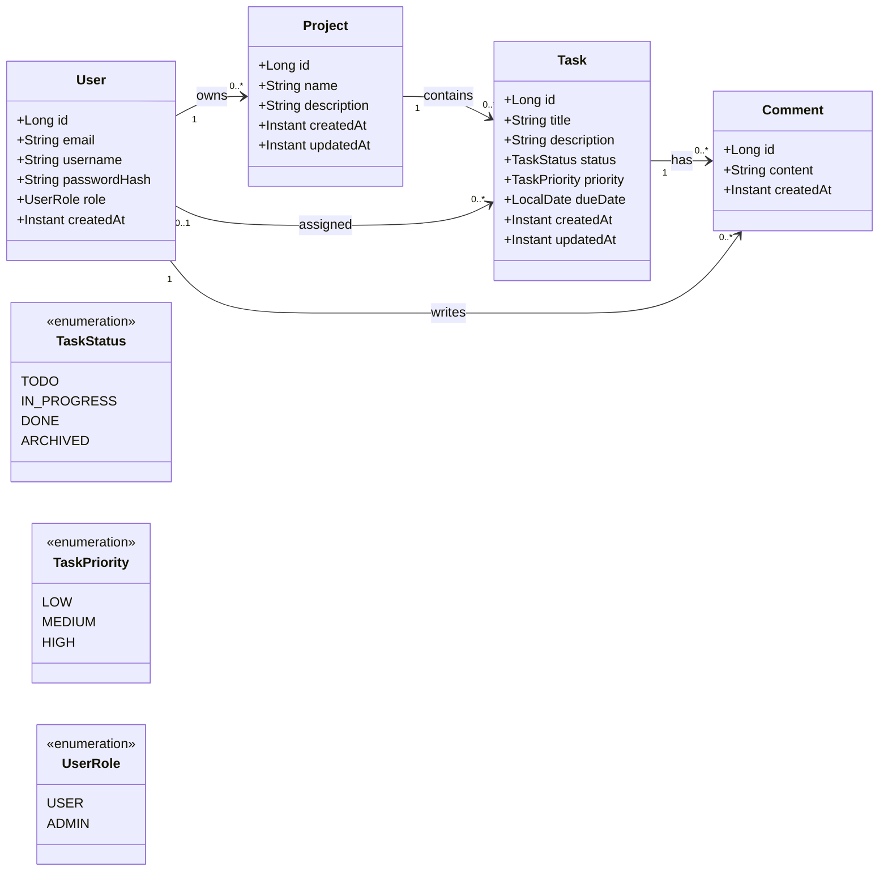

# Domain Model - Projet SI Java

## 1) Contexte et objectif

Le domaine métier couvre la gestion de projets et de tâches avec authentification utilisateur et administration basique. Ce modèle sert de base aux prochaines étapes (API REST, persistance, sécurité, tests).

## 2) Acteurs

- User : utilisateur authentifié qui gère ses projets, tâches et commentaires.
- Admin : utilisateur avec droits étendus de supervision.
- System (optionnel) : déclencheur d’actions automatiques (audit, notifications futures).

## 3) Cas d’usage (MVP + bonus)

- UC-01 : En tant que User, je veux créer un projet afin de structurer mon travail.
- UC-02 : En tant que User, je veux lister mes projets afin de visualiser mes éléments actifs.
- UC-03 : En tant que User, je veux ajouter une tâche à un projet afin de planifier les actions.
- UC-04 : En tant que User, je veux changer le statut d’une tâche afin de suivre l’avancement.
- UC-05 : En tant que User, je veux modifier une tâche afin d’ajuster son contenu.
- UC-06 : En tant que User, je veux supprimer une tâche afin de nettoyer le backlog.
- UC-07 : En tant que User, je veux ajouter un commentaire à une tâche afin de tracer les échanges.
- UC-08 : En tant que Admin, je veux lister les utilisateurs afin de superviser la plateforme.

## 4) Entités métier retenues

Entités de base (MVP) :

- `User`
- `Project`
- `Task`
- `Comment`

Éléments de support :

- `TaskStatus` (enum)
- `TaskPriority` (enum)
- `UserRole` (enum)

## 5) Attributs et types

### User

- `id : Long`
- `email : String` (obligatoire, unique)
- `username : String` (obligatoire, unique recommandé)
- `passwordHash : String` (obligatoire dès la séance sécurité)
- `role : UserRole`
- `createdAt : Instant`

### Project

- `id : Long`
- `name : String`
- `description : String`
- `owner : User`
- `createdAt : Instant`
- `updatedAt : Instant`

### Task

- `id : Long`
- `title : String`
- `description : String`
- `status : TaskStatus`
- `priority : TaskPriority`
- `project : Project`
- `assignee : User` (optionnel)
- `dueDate : LocalDate` (optionnel)
- `createdAt : Instant`
- `updatedAt : Instant`

### Comment

- `id : Long`
- `content : String`
- `task : Task`
- `author : User`
- `createdAt : Instant`

## 6) Enums

### TaskStatus

- `TODO`
- `IN_PROGRESS`
- `DONE`
- `ARCHIVED`

### TaskPriority

- `LOW`
- `MEDIUM`
- `HIGH`

### UserRole

- `USER`
- `ADMIN`

## 7) Relations et cardinalités

- User `1` -> `0..*` Project (owns)
- Project `1` -> `0..*` Task (contains)
- Task `1` -> `0..*` Comment (has)
- User `1` -> `0..*` Comment (writes)
- User `0..1` -> `0..*` Task (assigned)

## 8) Règles métier

### 8.1 Invariants

User :

- email obligatoire et unique
- username obligatoire
- rôle obligatoire

Project :

- nom obligatoire (1..80 caractères)
- owner obligatoire

Task :

- titre obligatoire (1..120 caractères)
- status obligatoire
- appartient à un project obligatoire
- dueDate non passée (si la règle est activée dans l’équipe)

Comment :

- contenu obligatoire (1..500 caractères)
- auteur obligatoire
- tâche obligatoire

### 8.2 Validations techniques vs métier

- Technique : format email, null-check, tailles minimales/maximales.
- Métier : transitions de statut autorisées, ownership, permissions d’accès.

### 8.3 Workflow TaskStatus

Transitions autorisées :

- TODO -> IN_PROGRESS
- IN_PROGRESS -> TODO
- IN_PROGRESS -> DONE
- DONE -> ARCHIVED
- TODO -> ARCHIVED

Transitions interdites (MVP) :

- DONE -> TODO
- ARCHIVED -> TODO
- ARCHIVED -> IN_PROGRESS
- ARCHIVED -> DONE

### 8.4 Règles d’autorisation (aperçu)

- seul le owner d’un projet peut modifier/supprimer son projet
- un User ne voit que ses projets et tâches associées
- Admin peut lister tous les utilisateurs
- les actions d’écriture exigent un utilisateur authentifié

## 9) Mapping backlog -> modèle

| User Story | Entités impliquées | Données principales | Règles métier |
|---|---|---|---|
| US-01 Créer compte | User | email, username, passwordHash | email unique |
| US-05 Créer projet | User, Project | name, owner | owner obligatoire |
| US-09 Ajouter tâche | Project, Task | title, status, project | status initial TODO |
| US-10 Changer statut | Task | status | transitions contrôlées |
| US-15 Lister utilisateurs | User | role | admin requis |

## 10) Diagramme de classes (Mermaid)

## 11) Checklist qualité

- [x] Entités limitées et justifiées par backlog
- [x] Cardinalités explicites
- [x] Enums pour statuts/roles
- [x] Règles métier et workflow définis
- [x] Mapping user stories -> modèle présent
